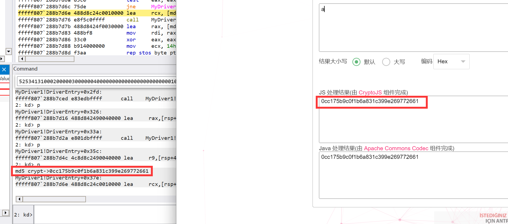
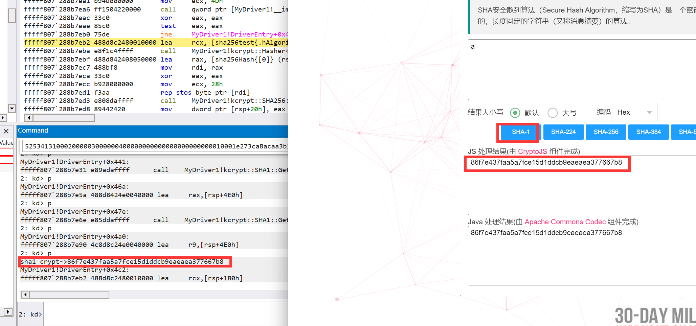
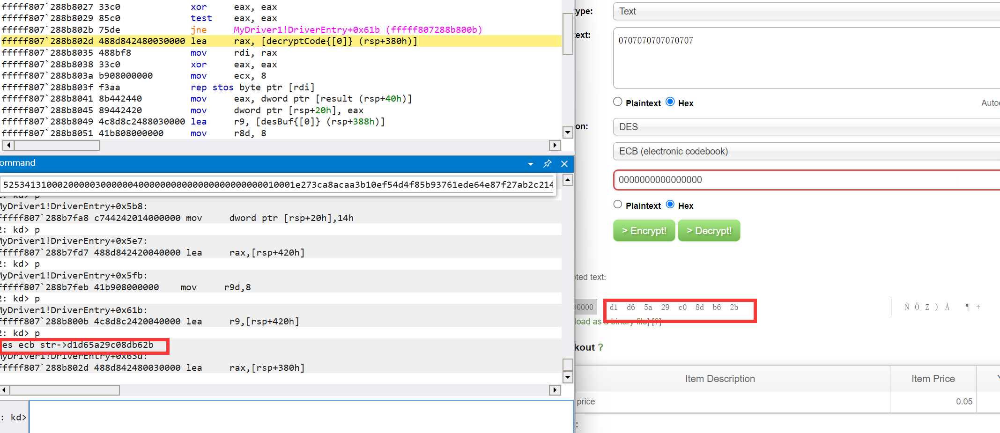
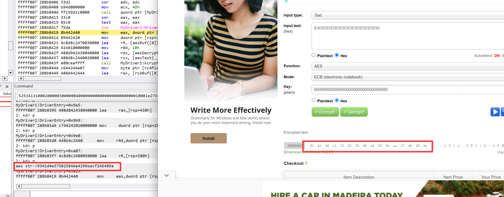

# Introduction

- **kcrypt是一个用于windows内核和驱动编写的的加密库库中包含了常用的加解密算法**

- Kcrypt is an encryption library designed for Windows kernel and driver programming. It contains a wide variety of commonly used encryption and decryption algorithms.

- 数字摘要包括MD4-MD5 SHA1-SHA512 对称加密包括DES 3DES AES RC4 非对称加密包括 RSA 并且支持IV和不同的加密模式(块加密的CBC,ECB等等)
- Digest algorithms include: MD4, MD5, SHA1 to SHA512. Symmetric encryption algorithms include: DES, 3DES, AES, RC4. Asymmetric encryption algorithm includes: RSA.Moreover, it supports Initialization Vector (IV) and various encryption modes (like block cipher modes of operation: CBC, ECB, and so on).

# How to use

- 把三个hpp文件引入,然后#include <Hasher.hpp> #include <SymCipher.hpp> #include <ASymCipher.hpp> 接着必须在连接器选项->引入->添加cng.lib这个库

- First, incorporate the three hpp files, then add the following lines to your code:

```C++
#include <Hasher.hpp>
#include <SymCipher.hpp>
#include <ASymCipher.hpp>
```

Subsequently, you need to add the cng.lib library in your linker options.

# Demo

## Digest 

```C++
unsigned char plainText[2] = { 'a','\0' };
	//MD5 Test
	kcrypt::Md5Creator md5test;
	unsigned char md5Hash[20]{0};
	md5test.crypt(plainText,1, md5Hash, kcrypt::MD5::GetHashLength());
	char md5Str[40]{ 0 };
	kcrypt::hexToStr(md5Str, sizeof (md5Str), md5Hash, kcrypt::MD5::GetHashLength());
	printk("md5 crypt->%s\r\n", md5Str);
```



```C++
	//SHA1 TEST
	kcrypt::SHA1Creator sha1test;
	unsigned char sha1Hash[20]{ 0 };
	sha1test.crypt(plainText, 1, sha1Hash, kcrypt::SHA1::GetHashLength());
	char sha1Str[40]{ 0 };
	kcrypt::hexToStr(sha1Str, sizeof sha1Str, sha1Hash, kcrypt::SHA1::GetHashLength());
	printk("sha1 crypt->%s\r\n", sha1Str);
```



## Symmetric cipher

use default key(0)

**DES ecb test**

```C++
//DES test ecb
	unsigned char desPlainText[8] = { 0 };
	memset(desPlainText, 7, 8);
	kcrypt::DESCreator desTest;
	unsigned char desBuf[20] {0};
	auto result=desTest.encrypt(desPlainText, sizeof desPlainText, desBuf,sizeof desBuf);
	char desStr[20]{ 0 };
	kcrypt::hexToStr(desStr, sizeof desStr, desBuf, 8);
	printk("des ecb str->%s\r\n", desStr);
	//decrypt test
	unsigned char decryptCode[8]{ 0 };
	desTest.decrypt(decryptCode, sizeof decryptCode, desBuf, result);
```



**AES test**



## Asymmetric Cipher

RSA test

```C++
unsigned char rsaPlainText[1] = { 7 };
	unsigned char rsaBuf[500] = { 0 };
	char rsaStr[40]{ 0 };
	unsigned char rsadecryptCode[1] = { 0 };
	kcrypt::RSACreator rsatest;
	auto [pubkey, pubkeysize] = rsatest.getPubKey();
	auto [prikey, prikeysize] = rsatest.getPriKey();
#pragma  warning(disable :4996)
	auto pubKeyStr = (char*)ExAllocatePoolWithTag(NonPagedPool, PAGE_SIZE, 'tmp');
	auto priKeyStr = (char*)ExAllocatePoolWithTag(NonPagedPool, PAGE_SIZE, 'tmp');
	memset(pubKeyStr, 0, PAGE_SIZE);
	memset(priKeyStr, 0, PAGE_SIZE);
	kcrypt::hexToStr(priKeyStr, PAGE_SIZE, prikey, prikeysize);
	kcrypt::hexToStr(pubKeyStr, PAGE_SIZE, pubkey, pubkeysize);
	printk("pub key ->%s\r\n pri key ->%s\r\n", pubKeyStr,priKeyStr);
	// You can leave arg5 and arg6 blank, 
	// as this will use the default public key for encryption
	// and the private key for decryption.
	result=rsatest.encrypt(rsaPlainText, sizeof rsaPlainText, rsaBuf, sizeof rsaBuf);
	kcrypt::hexToStr(rsaStr, sizeof rsaStr, rsaBuf, result);
	printk("rsa str->%s\r\n", rsaStr);
	//rsatest.decrypt(rsadecryptCode, sizeof rsadecryptCode, rsaBuf, result);
	//and you can fill any pubkey or private key to encrypt and decrypt 
	result = rsatest.encrypt(rsaPlainText, sizeof rsaPlainText, 
		rsaBuf, sizeof rsaBuf, pubkey, pubkeysize);
	rsatest.decrypt(rsadecryptCode, sizeof rsadecryptCode, rsaBuf, result);
	ExFreePool(pubKeyStr);
```


# Support OS

test on windows 19044 1909

